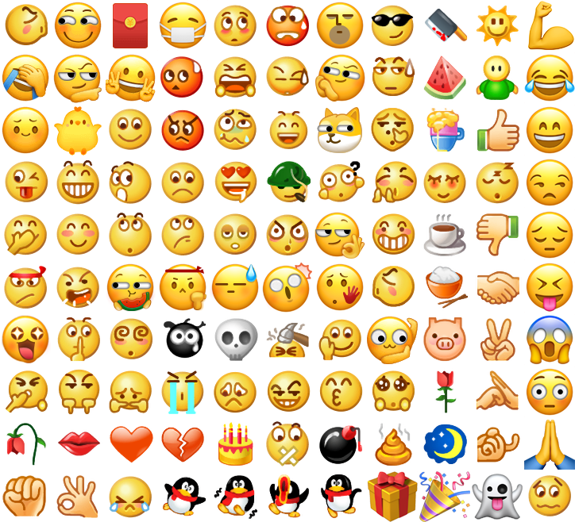

# emoji

仿微信表情组件。使用前需将文档下方提供的表情雪碧图上传 `CDN`，再传入表情组件。

## 属性列表

| 属性             | 类型        | 默认值  | 必填 | 说明                             |
| ---------------- | ----------- | ------- | ---- | -------------------------------- |
| source           | string      |         | 是   | 表情雪碧图地址                   |
| height           | number      | 300     | 否   | 表情盘高度                       |
| background-color | string      | #EDEDED | 否   | 表情盘背景色                     |
| show-send        | boolean     | true    | 否   | 是否显示发送按钮                 |
| show-del         | boolean     | true    | 否   | 是否显示删除按钮                 |
| show-history     | boolean     | true    | 否   | 是否显示最近使用                 |
| bindinsertemoji  | eventhandle |         | 否   | 插入表情，e.detail={emotionName} |
| binddelemoji     | eventhandle |         | 否   | 点击删除按钮                     |
| bindsend         | eventhandle |         | 否   | 点击发送按钮                     |

## 示例代码


## 使用方式

点击表情图标将会获得对应的中文含义，例如😊->[微笑]。在实际输入过程中，我们通常仅展示中文含义即可。

对文字和表情混合的评论需要解析后才能展示，组件内提供了 `parseEmoji` 解析函数，获取方式如下：

```js
// .mp-emoji 为表情组件的选择器
const emojiInstance = this.selectComponent('.mp-emoji')
const emojiNames = emojiInstance.getEmojiNames()
const parseEmoji = emojiInstance.parseEmoji
const comment = '测试[得意][偷笑]文本'
const parsedCommnet = parseEmoji(comment)
```

解析后的评论结构如下，文字和表情分割构成的数组，`type=1` 为纯文本，`type=2` 为表情 `icon`，`imageClass` 记录了表情在雪碧图上的位置。需注意的是组件开启了 `styleIsolation: 'page-shared'`，组件内样式与页面共享。

```js
[
  {type: 1, content: '测试'},
  {type: 2}, content: '[得意]', imageClass: 'smiley_4'}
  {type: 2}, content: '[偷笑]', imageClass: 'smiley_20'},
  {type: 1, content: '文本'},
]
```

由于表情 `icon` 采用雪碧图生成，展示时可采用如下的结构。需要注意的是每个 `icon` 的实际大小为 64px，因此在段落中通过 `scale` 进行缩放，缩放的比例为 行高 / 64。

```html
<view class="comment">
  <block wx:for="{{parsedComment}}" wx:key="*this">
    <block wx:if="{{item.type === 1}}">{{item.content}}</block>
    <view wx:if="{{item.type === 2}}" style="display: inline-block; width: {{lineHeight}}px; height: {{lineHeight}}px">
      <view 
        class="{{item.imageClass}}"
        style="background-image: url({{emojiSource}});transform-origin: 0 0; transform: scale({{lineHeight / 64}});">
      </view>
    </view>
  </block>
</view>
```

```css
.comment {
  font-size: 18px;
  display: flex;
  align-items: center;
  flex-wrap: wrap;
  line-height: 24px;
}
```

如何与 `input` 结合使用，参考示例代码。

### 表情雪碧图

